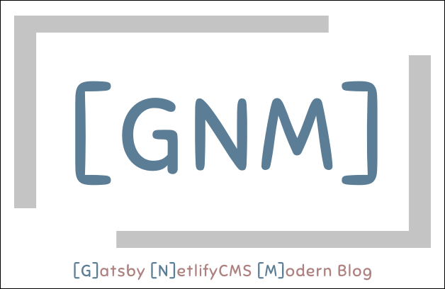
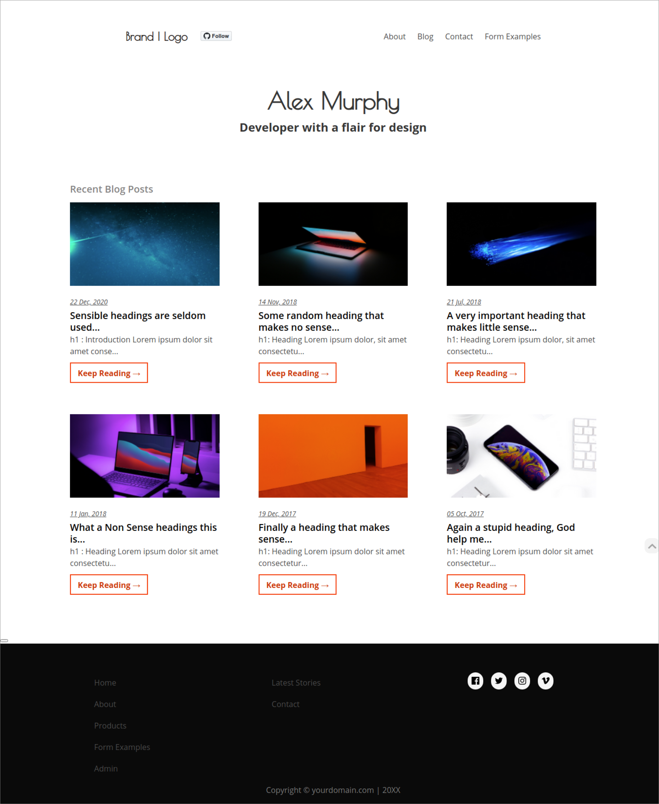
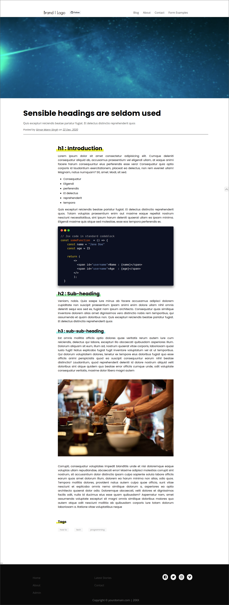

# Gatsby Netlify CMS Modern blog

<div align="center" style="margin-bottom:30px">
    
[](https://app.netlify.com/sites/gatsby-starter-netlify-cms-ci/deploys)
[](code_of_conduct.md)
    <a href="https://twitter.com/intent/tweet?text=A%20Modern%20Gatsby%20andNetlifyCMS%20based%20starter%20template%3A&url=https%3A%2F%2Fgithub.com%2Fsimarmannsingh%2Fgatsby-netlifycms-starter-template">

</a>
</div>

<div align="center"  style="margin-bottom:30px">
    
</div>


--------------------------------------------------------------------

[**LIVE DEMO**](https://gatsby-netlifycms-modern-template.netlify.app/)

A fully-responsive [Gatsby](https://www.gatsbyjs.org/) based web-app template which can be easily hosted on any platform. This web-app uses the [Netlify CMS](https://www.netlifycms.org) as its content management system.

It follows the [JAMstack architecture](https://jamstack.org) by using Git as a single source of truth, and [Netlify](https://www.netlify.com) for continuous deployment, and CDN distribution. Surely you can use a different host. Netlify CMS and Netlify are two different products and not to be confused as one dependent on another. You are free to use both in combination and separately as well.

<div align="center"  style="margin-bottom:30px">
    
</div>

A detailed blog post on how you can use this template for your blog (for free obviously) can be found [**here**](https://simarmannsingh.com/blog/2021-04-22-how-to-create-your-personal-blog-for-free)


## Getting Started

There are two ways you can use this template 

1. First Approach(**Recommended**)
   Use the button below and it'll automatically take you to the netlify and ask you to create a repository on your behalf in Github/Gitlab/Bitbucket as per you select. This is the recommended approach as it automatically takes care of all the process steps. You don't need to do anything else.

   <a href="https://app.netlify.com/start/deploy?repository=https://github.com/simarmannsingh/gatsby-netlifycms-starter-template&amp;stack=cms"></a>

2. Second Approach
   Do it manually. It requires you to clone/fork this repository in your Github account, and setup the development environment in your system, install all the dependencies and then setup netlify account to pull the github published code for deployment. This approach is for advanced users as it allows users to edit the code and tweak the code as per preferences and it requires knowledge of code, development environment, deployment etc.  

### A Screenshot of the Blog Post.

<div align="center"  style="margin-bottom:30px">
    
</div>

## Features

- A simple blogging web-app built with Netlify CMS
- Editable Pages: About, Blog-Collection and Contact page with Netlify Form support
- Custom 404 page
- Tags support: Separate page for posts under each tag
- Scroll to Top button on every page
- Create Blog posts from Netlify CMS
- Uses Bulma for styling, but size is reduced by `purge-css-plugin`
- Blazing fast loading times thanks to pre-rendered HTML and automatic chunk loading of JS files
- Uses `gatsby-image` with Netlify-CMS preview support
- Separate components for everything
- Perfect score on Lighthouse for SEO, Accessibility and Performance

## Prerequisites for the development environment

For local development, you need
- Node (v8.2.0 or higher)
- [Gatsby CLI](https://www.gatsbyjs.org/docs/)
- [Netlify CLI](https://github.com/netlify/cli)

### Setting up the CMS

Follow the [Netlify CMS Quick Start Guide](https://www.netlifycms.org/docs/quick-start/#authentication) to set up authentication, and hosting. You would need to enable Identity in the Netlify account if you are using Netlify for website deployment.

### Debugging

Windows users might encounter `node-gyp` errors when trying to npm install.
To resolve, make sure that you have both Python 2.7 and the Visual C++ build environment installed.

```
npm config set python python2.7
npm install --global --production windows-build-tools
```

[Full details here](https://www.npmjs.com/package/node-gyp 'NPM node-gyp page')

MacOS users might also encounter some errors, for more info check [node-gyp](https://github.com/nodejs/node-gyp). We recommend using the latest stable node version.

### Purgecss

This plugin uses [gatsby-plugin-purgecss](https://www.gatsbyjs.org/packages/gatsby-plugin-purgecss/) and [bulma](https://bulma.io/). The bulma builds which usually generate a ~170Kb of .css file are reduced 90% by purgecss resulting in a .css file which at max is 16-18Kb.

## Contribution

Contributions are always welcome, no matter how large or small. Before contributing,
please read the [code of conduct](CODE_OF_CONDUCT.md).


## Upcoming Features in Next version (TODO)
- Dark Theme
- Comment functionality
- Likes functionality

## License

This repository has MIT license which can be found [here](https://github.com/simarmannsingh/gatsby-netlifycms-starter-template/blob/master/LICENSE).